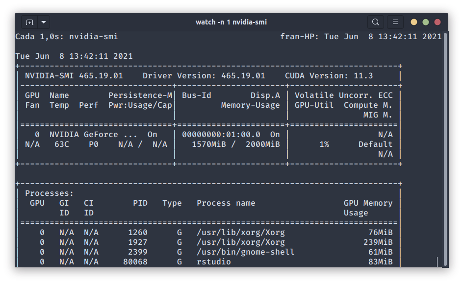
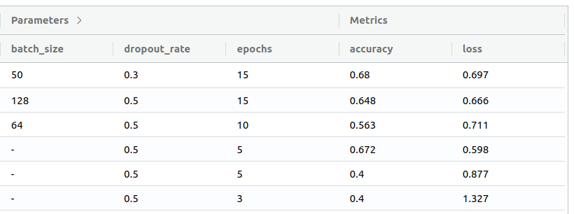

\newpage

```{r setup, include=FALSE}
knitr::opts_chunk$set(echo = TRUE, message = FALSE, warning = FALSE)
library(tidyverse)
library(reticulate)
use_condaenv('r-tensorflow')
library(keras)

#### WORKARROUND para que TF funcione en GPU, comentar las lineas si se actualiza
# y se resuelve el bug https://github.com/tensorflow/tensorflow/issues/43174
library(tensorflow)
physical_devices <- tf$config$list_physical_devices('GPU')
tf$config$experimental$set_memory_growth(physical_devices[[1]], TRUE)
####

```

El conjunto de datos Fakeeddit contiene más de un millón de publicaciones de Reddit que contienen algún tipo de desinformación. El problema de clasificación con Fakeddit consiste en predecir si una publicación es una "noticia falsa". Existen varias versiones del problema según las categorías de "falsedad", desde clasificación binaria a clasificación con seis clases.

# Carga de datos

Directorios:

```{r}
dataset_dir           <- './datasets/medium10000_twoClasses/'

train_images_dir      <- paste0(dataset_dir, 'train')
val_images_dir        <- paste0(dataset_dir, 'val')
test_images_dir       <- paste0(dataset_dir, 'test')
```

Generadores:

```{r}
# https://tensorflow.rstudio.com/keras/reference/image_data_generator.html 
train_images_generator <- image_data_generator(rescale = 1/255)
val_images_generator   <- image_data_generator(rescale = 1/255)
test_images_generator  <- image_data_generator(rescale = 1/255)
```

Flujos:

```{r}
# https://tensorflow.rstudio.com/keras/reference/flow_images_from_directory.html
# https://forums.fast.ai/t/split-data-using-fit-generator/4380/4
batch_size <- 64
train_generator_flow <- flow_images_from_directory(
  directory = train_images_dir,
  generator = train_images_generator,
  class_mode = 'categorical',
  batch_size = batch_size,
  target_size = c(64, 64)         # (w x h) --> (64 x 64)
)

validation_generator_flow <- flow_images_from_directory(
  directory = val_images_dir,
  generator = val_images_generator,
  class_mode = 'categorical',
  batch_size = batch_size,
  target_size = c(64, 64)         # (w x h) --> (64 x 64)
)

test_generator_flow <- flow_images_from_directory(
  directory = test_images_dir,
  generator = test_images_generator,
  class_mode = 'categorical',
  batch_size = batch_size,
  target_size = c(64, 64)         # (w x h) --> (64 x 64)
)
```

Metadatos:

```{r}
metadata_train <- read_tsv(paste0(train_images_dir, "/multimodal_train.tsv"))
metadata_train <- metadata_train %>%
  mutate(created_at = as.POSIXct(created_utc, origin="1970-01-01")) %>%
  mutate(class = ifelse(`2_way_label` == 0, 'Disinformation', 'Other')) %>% 
  select(-all_of(c('created_utc', '6_way_label', '3_way_label', '2_way_label' )))
```

# Análisis exploratorio

Visión general del conjunto de datos:

```{r resumen}
summary(metadata_train)
```

Estado del conjunto de datos:

```{r status}
library(funModeling)
df_status(metadata_train)
```

## Analizar clases

Vamos a analizar cuántos valores tenemos de cada clase:

```{r tabla}
table(metadata_train$class)
```

Y crear un histograma:

```{r clases, warning=FALSE}
ggplot(metadata_train) +
geom_histogram(aes(x = class, fill = as.factor(class)), stat = "count") +
labs(x = "", y = "") 
```

## Analizando en que subreddit hay mayor desinformación

```{r}
plotdata <- metadata_train %>%
  filter(class == "Disinformation") %>%
  count(subreddit) %>%
  slice_max(n = 15, order_by = n, with_ties = FALSE)
  
ggplot(plotdata) +
  geom_bar(aes(x = subreddit, y = n), stat = 'identity') +
  coord_flip()
```

## Evolución

Evolución temporal (frecuencia acumulada):

```{r}
library(scales)
ggplot(metadata_train, aes(x = created_at)) +
  geom_histogram(aes(fill = class))
```

Nos quedamos con las columnas relevantes e inputamos los valores perdidos:

```{r results='hide'}
library(mice)
data_binary_factors <- metadata_train %>%
  select(-one_of("author", "clean_title", "id", "image_url", "linked_submission_id", "title", 'domain')) %>%
  mutate_if(is.character, as.factor)
imputation <- mice(data_binary_factors, defaultMethod = c('mean', 'logreg', 'polyreg', 'polr'))
train <- complete(imputation) %>% na.omit()
```

# Clasificación

## Usando MLflow

Para mejorar la gestión del aprendizaje y el lanzamiento de experimentos de una forma controlada se ha usado `mlflow`. De esta forma hemos sido capaces de parametrizar de forma sencilla los hiperparámetros de nuestro proyecto y, además, manteniendo un tracking de todo lo que vamos haciendo, así como guardando los mejores experimentos y haciendo comparativas entre las diferentes configuraciones.

Por tanto, para todo el proceso de aprendizaje y flujo de trabajo se ha utilizado mlflow. Por una parte, hemos creado un script `mlflow.R` que es desde donde se lanzan los diferentes experimentos. Y por otra, cada fichero R que entrena un modelo ha sido adaptado para poder funcionar con mlflow e integrando la parametrización que proporciona. En concreto se han parametrizado los siguientes hiperparámetros:

```{R}
hidden_units      <- mlflow_param("hidden_units", 100, "integer", "Número de neuronas de las capas (densas) ocultas")
hidden_activation <- mlflow_param("hidden_activation", "relu", "string", "Función de activación")
dropout_rate      <- mlflow_param("dropout_rate", 0.5, "numeric", "Probabilidad de dropout")
epsilon           <- mlflow_param("epsilon", 0.01, "numeric", "Parámetro epsilon para la normalización")
batch_size        <- mlflow_param("batch_size", 64, "integer", "Tamaño de los mini-lotes")
epochs            <- mlflow_param("epochs", 5, "integer", "Número de eras")
```

## Clasificación binaria usando imágenes

Como primera aproximación para resolver el problema de clasificación binaria entrenaremos un modelo que será entrenado con el conjunto de imágenes de prueba. El primer modelo utilizado será una red convolucional a la que le aplicaremos diferentes técnicas de mejora de aprendizaje. En concreto aplicaremos técnicas de:

-   Normalización: aplicaremos capas `layer_batch_normalization` a continuación de las capas convolucionales.
-   Early Stopping: se realizará un guardado periódico del modelo para ir supervisando el error de validación y terminar la ejecución cuando ese error aumente.
-   Dropout: aplicaremos capas `dropout` a las capas densas para prevenir el sobreaprendizaje.

### Creación del modelo

```{r warning=FALSE}
model <- keras_model_sequential() %>%
  layer_conv_2d(filters = 128,  kernel_size = c(3, 3), activation = hidden_activation, input_shape = c(64, 64, 3)) %>% layer_max_pooling_2d(pool_size = c(2, 2)) %>%
  layer_conv_2d(filters = 128,  kernel_size = c(3, 3), activation = hidden_activation) %>% layer_batch_normalization(epsilon = epsilon) %>% layer_max_pooling_2d(pool_size = c(2, 2)) %>%
  layer_conv_2d(filters = 64, kernel_size = c(3, 3), activation = hidden_activation) %>% layer_batch_normalization(epsilon = epsilon) %>% layer_max_pooling_2d(pool_size = c(2, 2)) %>%
  layer_conv_2d(filters = 32, kernel_size = c(3, 3), activation = hidden_activation) %>% layer_batch_normalization(epsilon = epsilon) %>% layer_max_pooling_2d(pool_size = c(2, 2)) %>%
  layer_flatten() %>%
  layer_dense(units = hidden_units, activation = hidden_activation) %>%
  layer_dropout(rate = dropout_rate) %>% 
  layer_dense(units = hidden_units, activation = hidden_activation) %>%
  layer_dropout(rate = dropout_rate) %>% 
  layer_dense(units = 2, activation = "softmax")
```

```{r}
summary(model)
```

En cuanto a la topología de la red, tenemos una red convolucional tradicional. En concreto, tenemos 4 capas convolucionales que comienzan con 128 kernels en la primera capa y va disminuyendo el número de kernels a medida que aumenta la profundidad. Además, aplicamos una normalización a las salidas de estas capas, con el objetivo de que se mantengan dentro de un mismo rango y lograr de esta manera una mejora en el aprendizaje consiguiendo que el modelo dependa menos del preprocesamiento y la inicialización de los pesos. Terminando con las capas convolucionales, hemos añadido una capa de pooling al final de cada salida de las capas convolucionales (después de la normalización).

Pasando a la parte final del modelo, tenemos dos capas densas a las que le aplicamos un mecanismo de dropout, en el que desactivaremos algunas de las neuronas en cada era. Como este primer problema es una clasificación binaria, tenemos una capa final de tipo softmax con dos neuronas, que darán la probabilidad de que una imagen pertenezca (o no) a una noticia con desinformación.

Compilar modelo:

```{r}
model %>% compile(
  loss = 'categorical_crossentropy',
  optimizer = optimizer_adam(),
  metrics = c('accuracy')
)
```

### Entrenamiento y test

#### Inciso. Eliminando imágenes corruptas

Cuando me disponía a entrenar la red, keras me lanzaba el siguiente error: `UnidentifiedImageError: cannot identify image file`, así que me imaginé que había alguna imagen que no estaba funcionando correctamente. Para solucionarlo he creado un pequeño script en python que recorre todas las imágenes del dataset y detecta si hay algún error con ellas, el script en cuestión es `check_images.py`. Tras lanzar el script se detectó que las siguientes imágenes estaban corruptas: `['datasets/medium10000_twoClasses/val/0/d0moj4t.jpg', 'datasets/medium10000_twoClasses/train/0/cakwaac.jpg', 'datasets/medium10000_twoClasses/train/0/c6znmkl.jpg', 'datasets/medium10000_twoClasses/train/0/d14o3im.jpg', 'datasets/medium10000_twoClasses/train/0/c82s1pm.jpg', 'datasets/medium10000_twoClasses/train/0/cqgihgw.jpg', 'datasets/medium10000_twoClasses/train/0/c6o24rp.jpg', 'datasets/medium10000_twoClasses/train/0/cfiq37y.jpg', 'datasets/medium10000_twoClasses/train/0/c50lt7l.jpg']`

> EDIT: Posteriormente he visto que ya se había dado este problema y que había una solución propuesta en el GitHub de la asignatura, de todas formas dejo el script que he usado yo, ya que está hecho.

Ahora si, vamos a entrenar la red. Como decíamos, hemos utilizado mlflow para la gestión del aprendizaje y los diferentes experimentos los hemos lanzado modificando los parámetros que se pueden ver en la sección de mlflow.

Como la función `fit_generator` de keras está deprecada y no se aconseja su uso, en nuestras pruebas hemos utilizado la función `fit`. Esta función ya acepta generadores. Por otro lado, para calcular los `steps_per_epoch` para que se utilizaran todas las imágenes de entrenamiento se hace un sencillo calculo, en el que dividimos el número total de muestras que tenemos (10000) entre el tamaño de los mini-lotes que viene dado por el parámetro `batch_size`.

```{r}
history <- model %>% 
  fit(
    train_generator_flow, 
    validation_data = validation_generator_flow,
    steps_per_epoch = train_generator_flow$samples / batch_size,
    epochs = epochs
  )
```

Test:
```{r}
  metrics <- model %>% 
    evaluate_generator(test_generator_flow, steps = 1)
```

#### Usando la GPU. O no.

Antes de comentar los resultados obtenidos, quería hablar sobre el uso de la GPU para acelerar los procesos de entrenamiento. En el caso de los equipos locales, disponemos de una tarjeta gráfica de Nvidia, concretamente el modelo GTX 1050 ti con 2GB de RAM, una tarjeta modesta, pero que seguro que ayudaría a mejorar los tiempos de entrenamiento, y digo ayudaría porque ha sido imposible configurar Tensorflow para que haga uso de la GPU. Se han instalado todas los paquetes y librerias necesarias para que fuese posible usar la GPU y se han aplicado soluciones para resolver todos los bugs que se presentaban, como el que aparece al principio de este notebook donde se aplica un workarround para solucionar un issue ya conocido por el equipo de tensorflow. Pero el problema no llega ahí, ya que, aunque parezca que tensorflow reconoce y hace uso de la GPU, como lo demuestran estos mensajes:

    2021-06-08 18:04:29.229599: I tensorflow/core/common_runtime/gpu/gpu_device.cc:1720] Found device 0 with properties: 
    pciBusID: 0000:01:00.0 name: NVIDIA GeForce GTX 1050 computeCapability: 6.1
    coreClock: 1.493GHz coreCount: 5 deviceMemorySize: 1.95GiB deviceMemoryBandwidth: 104.43GiB/s
    2021-06-08 18:04:29.229635: I tensorflow/stream_executor/platform/default/dso_loader.cc:49] Successfully opened dynamic library libcudart.so.11.0
    2021-06-08 18:04:29.229660: I tensorflow/stream_executor/platform/default/dso_loader.cc:49] Successfully opened dynamic library libcublas.so.11
    2021-06-08 18:04:29.229674: I tensorflow/stream_executor/platform/default/dso_loader.cc:49] Successfully opened dynamic library libcublasLt.so.11
    2021-06-08 18:04:29.229687: I tensorflow/stream_executor/platform/default/dso_loader.cc:49] Successfully opened dynamic library libcufft.so.10
    2021-06-08 18:04:29.229700: I tensorflow/stream_executor/platform/default/dso_loader.cc:49] Successfully opened dynamic library libcurand.so.10
    2021-06-08 18:04:29.229713: I tensorflow/stream_executor/platform/default/dso_loader.cc:49] Successfully opened dynamic library libcusolver.so.10
    2021-06-08 18:04:29.229747: I tensorflow/stream_executor/platform/default/dso_loader.cc:49] Successfully opened dynamic library libcusparse.so.11
    2021-06-08 18:04:29.229763: I tensorflow/stream_executor/platform/default/dso_loader.cc:49] Successfully opened dynamic library libcudnn.so.8

Cuando lanzamos un modelo para entrenar y comprobamos el uso de la GPU, con la utilidad `nvidia-smi` obtenemos el siguiente resultado (capturado mientras se ejecutaba el entrenamiento de un modelo):



Si nos fijamos en la utilización de la GPU, es del 1%! Por lo que al parecer no se está utilizando. Por tanto, no hemos podido lanzar los ejemplos en GPU, así que los tiempos obtenidos son los de CPU.

### Analizando el mejor resultado

El mejor resultado obtenido después de realizar una batería de ejecuciones sobre diferentes parámetros y modificaciones sobre la topología es:

```
CNN model (dropout_rate=0.3, epochs=15, batch_size= 50):
  loss: 0.696518003940582
  accuracy: 0.680000007152557
```

Sobre el conjunto de test obtenemos una precisión en torno al 70% con una pérdida de 0.697. En cuanto al tiempo de entrenamiento de este modelo, acudimos a mlflow y nos dice que el flujo completo de trabajo ha tardado: 30.4min, en los que se han ejecutado 15 eras, por lo que se ha tardado unos 2 minutos por era. El tamaño de los mini-lotes es de 50 imágenes.


### Comparando con otras ejecuciones

En la siguiente tabla, obtenida nuevamente de mlflow, tenemos una comparativa entre las ejecuciones realizadas, con las diferentes configuraciones:



Aunque no aparezcan en la tabla, adicionalmente se han realizado las siguientes modificaciones:

- Optimizador: se ha usado como optimizador rmsprop y Adam. El mejor resultado se ha obtenido con Adam.
- Topología: en primer lugar se probó la red con solo una capa densa, luego se hizo otra prueba con 2 capas densas y 2 capas de dropout. Se obtiene mejores resultados con 2 capas densas.


# Conclusión

TODO

